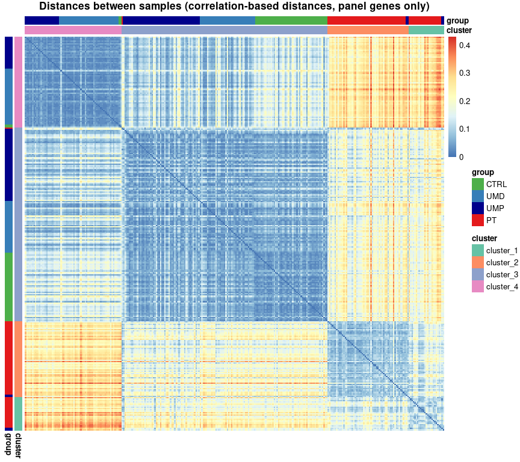

# Setup working environment

``` r
options(width=95)
set.seed(123)

my_wpath <- "/my/working/directory/"
setwd(my_wpath)
```

``` r
library("data.table")
library("dplyr")
library("scales")

library("ggplot2")
library("knitr")
library("kableExtra")
library("grid")
library("gridExtra")
library("RColorBrewer")
library("viridis")
library("cowplot")

library("UpSetR")
library("pheatmap")
library("factoextra")
library("FactoMineR")
library("mixOmics")

library("AIMS")
library("edgeR")
library("genefu")
data(pam50); data(pam50.robust)
library("clusterProfiler")
library("org.Hs.eg.db")
library("AnnotationDbi")
```

# Import data (raw counts)

NOTE: Raw counts need to be downloaded from the corresponding EGA
(European Genome-phenome Archive) record.

``` r
counts.raw <- read.csv(paste0(my_wpath,"raw_counts.txt"), sep="\t", header=T,
                       row.names=1, check.names=F)
samples <- colnames(counts.raw)
```

# Get and process annotations

NOTE: to use sample annotations, Supplementary File from the
corresponding publication needs to be downloaded into the working
directory.

``` r
samples_tab <- data.frame("sample"=samples, stringsAsFactors=F)
samples_tab$group <- gsub("^T","PT",gsub("\\d","",samples_tab$sample))
samples_tab$group <- gsub("^D","UMD",gsub("^A","UMP",samples_tab$group))
samples_tab$group <- factor(samples_tab$group, levels=c("CTRL","UMD","UMP","PT"))
#table(samples_tab$group)
samples_tab$patient <- gsub("[TAD]$|T1|T2","",samples_tab$sample)
#length(unique(subset(samples_tab, group=="CTRL")$patient)) # 53
#length(unique(subset(samples_tab, group!="CTRL")$patient)) # 83

meta.controls <- readxl::read_xlsx(paste0(my_wpath,"BMC_BCR_Additional_File1_13SEP2023.xlsx"),
                                   sheet=2, skip=1, trim_ws=T)
#all(meta.controls$`Control ID` %in% samples_tab$patient)
meta.cases <- readxl::read_xlsx(paste0(my_wpath,"BMC_BCR_Additional_File1_13SEP2023.xlsx"),
                                sheet=1, skip=1, trim_ws=T)
colnames(meta.cases)[25:28] <- c("PT1","PT2","UMP","UMD")
meta.cases <- meta.cases[-1,]
meta.cases$patient <- sprintf("%02d", meta.cases$`Manuscript ID`)
#all(meta.cases$patient %in% samples_tab$patient)

age <- c(meta.controls$Age, meta.cases$Age)
names(age) <- c(meta.controls$`Control ID`, meta.cases$patient)
samples_tab$age <- age[samples_tab$patient]

samples_tab$histpat <- samples_tab$histpat.PT <- "NA"
samples_tab$histpat.PT <- meta.cases[match(gsub("^0","",samples_tab$patient), meta.cases$`Manuscript ID`),]$`Subtype (j)`
samples_tab$histpat <- meta.cases[match(gsub("^0","",samples_tab$patient), meta.cases$`Manuscript ID`),]$`Subtype (j)`
samples_tab$histpat.PT[samples_tab$group=="CTRL"] <- "Normal"
samples_tab$histpat[samples_tab$group %in% c("CTRL","UMD","UMP")] <- "Normal"
samples_tab$histpat[is.na(samples_tab$histpat)] <- "NA"
samples_tab$histpat.PT[is.na(samples_tab$histpat.PT)] <- "NA"
```

``` r
## Load annotations - GTF for Gencode v35, AIMS and PAM50 genes
load(paste0(my_wpath,"aims_pam50_annotations.Rdata"))

targets <- readxl::read_xlsx(paste0(my_wpath,"BMC_BCR_Additional_File1_13SEP2023.xlsx"),
                             sheet=3, skip=1, trim_ws=T)
## The below has to be added to the table manually, and removed from the code
targets$EntrezID <- as.character(gtf$EntrezID[match(targets$`Gencode.v35 (c)`, gtf$gene_id)])
targets$EntrezID[targets$`Ensembl_ID (b)`=="ENSG00000253167"] <- "106479020"
targets$EntrezID[targets$`Ensembl_ID (b)`=="ENSG00000270141"] <- "7012"
```

# Create DGE object

``` r
## filter genes based on expression
keep_genes <- rowSums(edgeR::cpm(counts.raw)>=1)>=1
## make sure that AIMS and PAM50 genes are not removed by the above threshold
keep_genes[aims_genes$gene_id] <- TRUE
keep_genes[pam50$gene_id] <- TRUE

my_design <- model.matrix(~ 0 + samples_tab$age + samples_tab$group)
colnames(my_design) <- gsub("samples_tab\\$|group","",colnames(my_design))

dge <- DGEList(counts.raw[keep_genes,], remove.zeros=TRUE, group=samples_tab$group)
dge <- calcNormFactors(dge, method="TMM")
dge <- estimateDisp(dge, my_design)
counts.norm <- edgeR::cpm(dge)

#all(rownames(dge$samples)==samples_tab$sample)
dge$samples <- cbind(dge$samples, samples_tab[,c("sample","patient","age","histpat.PT","histpat")])
```

# PCA

``` r
sample_cols <- c("#4DAF4A","#377EB8","darkblue","#E41A1C")
names(sample_cols) <- levels(samples_tab$group)
my_annotation_colors <- list("group"=sample_cols)
```

``` r
norm_t <- t(counts.norm)
rownames(norm_t) <- samples_tab$sample[match(rownames(norm_t), samples_tab$sample)]
my.pca1 <- PCA(log(norm_t+1), graph=FALSE)

pca.plot1 <- fviz_pca_ind(my.pca1, habillage=dge$samples$group, invisible="quali", repel=TRUE, labelsize=2, title="",
                          addEllipses=F, palette=my_annotation_colors$group) + theme(legend.position="bottom")
pca.plot1b <- fviz_pca_ind(my.pca1, habillage=dge$samples$group, invisible="quali", repel=TRUE, labelsize=2, title="",
                           addEllipses=F, axes=c(1,3), palette=my_annotation_colors$group) + theme(legend.position="bottom")
```

``` r
plot_grid(pca.plot1, ncol=1, labels = paste0(nrow(dge)," genes (PC1 & PC2)"))
```

<div class="figure" style="text-align: center">


<p class="caption">
PCA plot of merged samples. Expression of all genes passing filtering
thresholds.
</p>

</div>

``` r
plot_grid(pca.plot1b, ncol=1, labels = paste0(nrow(dge)," genes (PC1 & PC3)"))
```

<div class="figure" style="text-align: center">


<p class="caption">
PCA plot of merged samples. Expression of all genes passing filtering
thresholds.
</p>

</div>

<br />

``` r
counts.norm.sub <- counts.norm[intersect(rownames(counts.norm),targets$`Gencode.v35 (c)`),] 

norm_t <- t(counts.norm.sub)
rownames(norm_t) <- samples_tab$sample[match(rownames(norm_t), samples_tab$sample)]
my.pca2 <- PCA(log(norm_t+1), graph=FALSE)

pca.plot2 <- fviz_pca_ind(my.pca2, habillage=dge$samples$group, invisible="quali", repel=TRUE,
  labelsize=2, title="", addEllipses=F, palette=my_annotation_colors$group) + theme(legend.position="bottom")
pca.plot2b <- fviz_pca_ind(my.pca2, habillage=dge$samples$group, invisible="quali", repel=TRUE,
  labelsize=2, title="", addEllipses=F, axes=c(1,3), palette=my_annotation_colors$group) + theme(legend.position="bottom")
```

``` r
plot_grid(pca.plot2, ncol=1, labels = "panel genes (PC1 & PC2)")
```

<div class="figure" style="text-align: center">


<p class="caption">
FIGURE 2, panel A
</p>

</div>

<br />

``` r
norm_t <- norm_t[samples_tab$sample[samples_tab$group!="PT"],]
my.pca3 <- PCA(log(norm_t+1), graph=FALSE)

pca.plot3 <- fviz_pca_ind(my.pca3, habillage=subset(dge$samples, group != "PT")$group,
  invisible="quali", repel=TRUE, labelsize=2, title="", addEllipses=F, palette=my_annotation_colors$group) +
  theme(legend.position="bottom")
pca.plot3b <- fviz_pca_ind(my.pca3, habillage=subset(dge$samples, group != "PT")$group,
  invisible="quali", repel=TRUE, labelsize=2, title="", addEllipses=F, palette = my_annotation_colors$group,
  axes=c(1,3)) + theme(legend.position="bottom")
```

``` r
plot_grid(pca.plot3, ncol=1, labels = "panel genes (PC1 & PC2)")
```

<div class="figure" style="text-align: center">


<p class="caption">
PCA plot of merged samples (non-malignant only). Expression of only the
panel genes.
</p>

</div>

``` r
plot_grid(pca.plot3b, ncol=1, labels = "panel genes (PC1 & PC3)")
```

<div class="figure" style="text-align: center">


<p class="caption">
PCA plot of merged samples, without PTs and Ms. Expression of only the
panel genes.
</p>

</div>

## PCA - contributions of variables

``` r
var1 <- get_pca_var(my.pca1)
var2 <- get_pca_var(my.pca2)
var3 <- get_pca_var(my.pca3)

var1.contrib1.plot <- fviz_contrib(my.pca1, choice = "var", axes = 1, top = 50)
var1.contrib2.plot <- fviz_contrib(my.pca1, choice = "var", axes = 2, top = 50)

var2.contrib1.plot <- fviz_contrib(my.pca2, choice = "var", axes = 1, top = 50)
var2.contrib2.plot <- fviz_contrib(my.pca2, choice = "var", axes = 2, top = 50)

var3.contrib1.plot <- fviz_contrib(my.pca3, choice = "var", axes = 1, top = 50)
var3.contrib2.plot <- fviz_contrib(my.pca3, choice = "var", axes = 2, top = 50)
var3.contrib3.plot <- fviz_contrib(my.pca3, choice = "var", axes = 3, top = 50)
```

``` r
var1.contrib1.plot <- var1.contrib1.plot + theme(axis.text.x = element_text(size = 6, face = "bold")) +
  scale_x_discrete(labels=unlist(gtf$gene_name)[match(rownames(head(var1$contrib[order(var1$contrib[,1],
  decreasing = T),],50)), gtf$gene_id)])
var1.contrib2.plot <- var1.contrib2.plot + theme(axis.text.x = element_text(size = 6, face = "bold")) +
  scale_x_discrete(labels=unlist(gtf$gene_name)[match(rownames(head(var1$contrib[order(var1$contrib[,2],
  decreasing = T),],50)), gtf$gene_id)])

plot_grid(var1.contrib1.plot, var1.contrib2.plot, ncol=2)
```

<div class="figure" style="text-align: center">


<p class="caption">
Contribution of variables to Dim 1 and Dim 2 - all genes
</p>

</div>

<br />

``` r
var2.contrib1.plot <- var2.contrib1.plot + theme(axis.text.x = element_text(size = 6, face = "bold")) +
  scale_x_discrete(labels=unlist(gtf$gene_name)[match(rownames(head(var2$contrib[order(var2$contrib[,1],
  decreasing = T),],50)), gtf$gene_id)])
var2.contrib2.plot <- var2.contrib2.plot + theme(axis.text.x = element_text(size = 6, face = "bold")) +
  scale_x_discrete(labels=unlist(gtf$gene_name)[match(rownames(head(var2$contrib[order(var2$contrib[,2],
  decreasing = T),],50)), gtf$gene_id)])

plot_grid(var2.contrib1.plot, var2.contrib2.plot, ncol=2)
```

<div class="figure" style="text-align: center">


<p class="caption">
Contribution of variables to Dim 1 and Dim 2 - panel genes
</p>

</div>

<br />

``` r
var3.contrib1.plot <- var3.contrib1.plot + theme(axis.text.x = element_text(size = 6, face = "bold")) +
  scale_x_discrete(labels=unlist(gtf$gene_name)[match(rownames(head(var3$contrib[order(var3$contrib[,1],
  decreasing = T),],50)), gtf$gene_id)]) 
var3.contrib2.plot <- var3.contrib2.plot + theme(axis.text.x = element_text(size = 6, face = "bold")) +
  scale_x_discrete(labels=unlist(gtf$gene_name)[match(rownames(head(var3$contrib[order(var3$contrib[,2],
  decreasing = T),],50)), gtf$gene_id)])
var3.contrib3.plot <- var3.contrib3.plot + theme(axis.text.x = element_text(size = 6, face = "bold")) +
  scale_x_discrete(labels=unlist(gtf$gene_name)[match(rownames(head(var3$contrib[order(var3$contrib[,3],
  decreasing = T),],50)), gtf$gene_id)])

plot_grid(var3.contrib1.plot, var3.contrib2.plot, var3.contrib3.plot, ncol=2)
```

<div class="figure" style="text-align: center">


<p class="caption">
Contribution of variables to Dim 1 and Dim 2 - panel genes, only
CONTROLs and UMs.
</p>

</div>

# AIMS and PAM50

``` r
ddata <- t(counts.norm)
ddata <- ddata[,unique(colnames(ddata))]
dannot <- gtf[match(colnames(ddata), gtf$gene_id),]
colnames(dannot) <- c("EnsemblGene.ID","Gene.Symbol","EnsemblGene.ID2","EntrezGene.ID")
rownames(dannot) <- dannot$EnsemblGene.ID
dannot$probe <- dannot$EntrezGene.ID
  
### AIMS
SubtypePredictions.AIMS <- molecular.subtyping(sbt.model="AIMS", data = ddata, annot=dannot, do.mapping=TRUE)
### PAM50
colnames(ddata) <- dannot$EntrezGene.ID[match(colnames(ddata), dannot$EnsemblGene.ID)]
SubtypePredictions.pam50 <- molecular.subtyping(sbt.model="pam50", data=ddata, annot=dannot, do.mapping=TRUE)

samples_tab$AIMS <- SubtypePredictions.AIMS$subtype[samples_tab$sample,]
dge$samples$AIMS <- SubtypePredictions.AIMS$subtype[colnames(dge),]
dge$samples$AIMS <- factor(dge$samples$AIMS, levels=c("Normal","LumA","LumB","Her2","Basal"))
#table(samples_tab$group, samples_tab$AIMS)
samples_tab$PAM50 <- as.character(SubtypePredictions.pam50$subtype[samples_tab$sample])
dge$samples$PAM50 <- as.character(SubtypePredictions.pam50$subtype[colnames(dge)])
dge$samples$PAM50 <- factor(dge$samples$PAM50, levels=c("Normal","LumA","LumB","Her2","Basal"))
#table(samples_tab$group, samples_tab$PAM50)
```

``` r
aims_types <- pam50_types <- c("Normal","LumA","LumB","Her2","Basal")
aims_cols <- brewer.pal(n = length(aims_types), name = "Paired")[c(5,3,4,2,1)]
names(aims_cols) <- aims_types

my_annotation_colors[["PAM50"]] <- my_annotation_colors[["AIMS"]] <- aims_cols
```

# Clustering

``` r
ph_scale <- colorRampPalette( c("green", "black", "red"), space="rgb")(10) #; show_col(ph_scale)

ph1 <- pheatmap::pheatmap(log2(counts.norm+1),  main="ALL genes (clustered)", cluster_rows=T, cluster_cols=T,
  cutree_cols=4, show_rownames=F, show_colnames=F, color=ph_scale, annotation_col=samples_tab[,"group",drop=F],
  annotation_colors=my_annotation_colors, drop_levels=T, silent=T, treeheight_row=15, treeheight_col=15)
ph2 <- pheatmap::pheatmap(log2(counts.norm.sub+1),  main="PANEL genes (clustered)", cluster_rows=T, cluster_cols=T,
  cutree_cols=4, show_rownames=F, show_colnames=F, color=ph_scale, annotation_col=samples_tab[,"group",drop=F],
  annotation_colors=my_annotation_colors, drop_levels=T, silent=T, treeheight_row=15, treeheight_col=15)

clusters.all <- data.frame(all=cutree(ph1$tree_col, k=4)[ph1$tree_col$order])
clusters.panel <- data.frame(all=cutree(ph2$tree_col, k=4)[ph2$tree_col$order])

clusters.combined <- data.frame(clusters.all)
clusters.combined$panel <- clusters.panel[rownames(clusters.combined),]
clusters.combined$group <- dge$samples[rownames(clusters.combined),]$group
```

``` r
dge$samples$cluster1 <- paste0("cluster_",clusters.combined[colnames(dge),]$all)
dge$samples$cluster1 <- factor(dge$samples$cluster1)
dge$samples$cluster2 <- paste0("cluster_",clusters.combined[colnames(dge),]$panel)
dge$samples$cluster2 <- factor(dge$samples$cluster2)
dge$samples$group.clust <- gsub("cluster","",paste(dge$samples$group, dge$samples$cluster2, sep=""))
```

``` r
table(dge$samples$cluster2, dge$samples$group, dnn=c("panel-based clusters","sample type"))
```

    ##                     sample type
    ## panel-based clusters CTRL UMD UMP PT
    ##            cluster_1    0   0   2 23
    ##            cluster_2    0   0   2 55
    ##            cluster_3   51  39  54  1
    ##            cluster_4    2  42  24  0

``` r
cluster_cols <- brewer.pal(n=4, name="Set2"); names(cluster_cols) <- sort(unique(dge$samples$cluster2))
my_annotation_colors$cluster <- cluster_cols

pca.plot2 <- fviz_pca_ind(my.pca2, habillage=dge$samples$cluster2, invisible="quali", repel=TRUE, labelsize=2, title="", addEllipses=T,
                         palette = cluster_cols) + theme(legend.position="bottom")
plot_grid(pca.plot2, ncol=1, labels = "PANEL genes (PC1 & PC2)")
```

<div class="figure" style="text-align: center">


<p class="caption">
Clusters on PCA plot.
</p>

</div>

``` r
histpat_types <- c("?","Luminal A","Luminal B2","Luminal B1","HER2 positive","TNBC","Normal")
histpat_cols <- c("grey","#8DA0CB","#E78AC3","#A6D854","#FC8D62","#FFD92F","#FB9A99")
names(histpat_cols) <- histpat_types
my_annotation_colors$histpat <- histpat_cols

ann <- dge$samples[,c("group","cluster2","histpat","PAM50","AIMS")];
colnames(ann) <- c("group","cluster","histpat","PAM50","AIMS")
ann <- ann[,5:1]
ann$histpat <- gsub("NA","?",ann$histpat)

ph1 <- pheatmap::pheatmap(log2(counts.norm.sub+1),  main="Panel genes (clustered)", cluster_rows=T, cluster_cols=T,
  cutree_cols=4, show_rownames=F, show_colnames=F, fontsize=8, color=ph_scale,annotation_col=ann,
  annotation_colors=my_annotation_colors, drop_levels=T, silent=T, treeheight_row=15, treeheight_col=15,
  cellwidth=2.2)

gridExtra::grid.arrange(ph1[[4]], ncol=1)
```

<div class="figure" style="text-align: center">


<p class="caption">
FIGURE 3
</p>

</div>

<br />

``` r
pseudoCounts <- log2(counts.norm[intersect(rownames(counts.norm), targets$`Gencode.v35 (c)`),]+1)

sample_order <- order(dge$samples$cluster2, dge$samples$group, decreasing = T)

cormat <- round(stats::cor(pseudoCounts, method = "pearson"),2)
cormat <- 1-cormat
cormat <- cormat[sample_order,sample_order]
```

``` r
pheatmap(cormat, annotation_row=ann[,c("cluster","group")], annotation_col=ann[,c("cluster","group")], cluster_rows=F,
         cluster_cols=F, annotation_colors=my_annotation_colors, show_rownames=F, show_colnames=F,
         main="Distances between samples (correlation-based distances, panel genes only)")
```

<div class="figure" style="text-align: center">


<p class="caption">
FIGURE 6
</p>

</div>

<br />

# Differential expression

## group-based (edgeR, QLF test)

``` r
age.check <- samples_tab[,c("group","age","patient")]
age.check <- age.check[match(unique(age.check$patient), age.check$patient),]
age.check$group <- as.character(age.check$group)
age.check$group[age.check$group!="CTRL"] <- "Cancer patient"
#wilcox.test(subset(age.check, group=="CTRL")$age, subset(age.check, group!="CTRL")$age) ## p-value = 1.324e-09
```

``` r
## define contrasts for main between-group comparisons
contMatrix <- makeContrasts(CTRL-(UMD+UMP)/2, CTRL-UMD, CTRL-UMP,
                            UMD-UMP,
                            CTRL-PT, (CTRL+UMD+UMP)/3-PT,
                            (UMD+UMP)/2-PT, UMD-PT, UMP-PT,
                            levels=my_design)

fitQLF <- glmQLFit(dge, my_design)

dge.QLF <- lapply(colnames(contMatrix), function(x) {
  glmQLFTest(fitQLF, contrast=contMatrix[,x]) %>% topTags(n=nrow(dge))
})
names(dge.QLF) <- colnames(contMatrix)

dge.QLF.sel <- lapply(dge.QLF, function(x) subset(x$table, FDR<0.05))
```

``` r
vd1 <- lapply(dge.QLF.sel, function(x) subset(x, abs(logFC)>=1));
vd1 <- lapply(vd1, rownames); names(vd1) <- colnames(contMatrix)
upset(fromList(vd1), sets=names(vd1), order.by="freq", keep.order=TRUE, sets.x.label="DEs per comparison",
      mb.ratio=c(0.6,0.4), sets.bar.color=brewer.pal(n=length(dge.QLF.sel), name="Spectral"), nintersects=20)
```

``` r
grid.edit('arrange', name='up1'); vd1 = grid.grab()
```

``` r
plot_grid(vd1, labels = c("DEGs filtered\nby FDR<0.05 & logFC>=1"), ncol=1, label_size = 10)
```

<div class="figure" style="text-align: center">


<p class="caption">
FIGURE 2, panel B
</p>

</div>

### Gene Ontology Enrichment

``` r
de_genes <- lapply(dge.QLF.sel[names(dge.QLF)], function(x) {
  res <- subset(x, abs(logFC)>=1)
  res <- split(res, res$logFC>0)
  res <- lapply(res, rownames); names(res) <- c("down","up")
  res <- lapply(res, function(x) gsub("\\..*","", x))
  return(res)
})
names(de_genes) <- names(dge.QLF)

my_universe <- rownames(counts.norm)
my_universe <- unique(gsub("\\..*","",my_universe))
```

``` r
pval <- 0.01; qval <- 0.05

de_genes.enrich_BP <- list()
for (comp in colnames(contMatrix)) {
  cp <- lapply(de_genes[[comp]], function(genes) {
    res = clusterProfiler::enrichGO(gene=as.vector(genes), universe=my_universe, OrgDb="org.Hs.eg.db",
                                    keyType="ENSEMBL", readable=T, ont="BP", pvalueCutoff=pval)
    res@result <- res@result[res@result$p.adjust <= qval, ]
    res2 <- clusterProfiler::simplify(res, cutoff=0.7, by="p.adjust", select_fun=min)
    res@result <- res@result[res@result$p.adjust <= qval, ]
    res@qvalueCutoff <- res@pvalueCutoff <- 0.05
    return(list("go"=res,"go_simp"=res2))
  })
  de_genes.enrich_BP[[comp]] <- cp
}
```

``` r
dotplot_list.BP <- lapply(names(de_genes.enrich_BP), function(x) {
  i <- de_genes.enrich_BP[[x]]
  i$up$go@pvalueCutoff <- i$up$go_simp@pvalueCutoff <- i$down$go@pvalueCutoff <- i$down$go_simp@pvalueCutoff <- 0.05
  i$up$go@qvalueCutoff <- i$up$go_simp@qvalueCutoff <- i$down$go@qvalueCutoff <- i$down$go_simp@qvalueCutoff <- 0.05
  res <- list()
  res[["down.go"]] <- enrichplot::dotplot(i$down$go, title=paste0(x, "; down DEGs, enriched BP"))
  res[["down.go_simp"]] <- enrichplot::dotplot(i$down$go_simp, title=paste0(x, "; down DEGs, enriched BP"))
  res[["up.go"]] <- enrichplot::dotplot(i$up$go, title=paste0(x, "; up DEGs, enriched BP"))
  res[["up.go_simp"]] <- enrichplot::dotplot(i$up$go_simp, title=paste0(x, "; up DEGs, enriched BP"))
  res <- lapply(res, function(x) x + theme(axis.text = element_text(size = 6), axis.text.x = element_text(size = 6),
                                           axis.text.y = element_text(size = 6), axis.title = element_text(size = 6),
                                           plot.title = element_text(size = 8), 
                                           legend.title=element_text(size=5), legend.text=element_text(size=5)))
  return(res)
})
```

``` r
pl <- lapply(dotplot_list.BP, function(x) {
  res <- list(x$up.go_simp, x$down.go_simp)
  res <- lapply(res, function(x) if (nrow(x$data)==0) { return(NULL) } else { return(x) })
  return(res)
})
pl <- unlist(pl, recursive = F)
plot_grid(plotlist = pl, ncol=2)
```

<div class="figure" style="text-align: center">


<p class="caption">
Top enriched GO terms (BP) among the identified DEGs.
</p>

</div>

<br />

### KEGG Pathway Enrichment

``` r
## We need to use Entrez ID for KEGG enrichment
de_genes2 <- lapply(de_genes, function(x) {
  x$up <- gtf$EntrezID[match(x$up, gsub("\\..*","",gtf$gene_id))]
  x$down <- gtf$EntrezID[match(x$down, gsub("\\..*","",gtf$gene_id))]
  x$up <- as.character(x$up[!is.na(x$up)])
  x$down <- as.character(x$down[!is.na(x$down)])
  return(x)
})
my_universe2 <- rownames(counts.norm); my_universe2 <- gtf$EntrezID[match(my_universe2, gtf$gene_id)]
my_universe2 <- sort(my_universe2[!is.na(my_universe2)]);
my_universe2 <- as.character(my_universe2); my_universe2 <- unique(my_universe2)
```

``` r
de_genes.enrich_KEGG <- lapply(de_genes2, function(x) {
    res <- list()
    res[["up"]] <- clusterProfiler::enrichKEGG(gene=x$up, organism="hsa", keyType="ncbi-geneid",
                                               pvalueCutoff=pval, universe = my_universe2)
    res[["down"]] <- clusterProfiler::enrichKEGG(gene=x$down, organism="hsa", keyType="ncbi-geneid",
                                                 pvalueCutoff=pval, universe = my_universe2)
    res[["up"]]@result <- subset(res[["up"]]@result, p.adjust < qval)
    res[["down"]]@result <- subset(res[["down"]]@result, p.adjust < qval)
    res[["down"]]@qvalueCutoff <- res[["up"]]@qvalueCutoff <- 0.05
    res[["down"]]@pvalueCutoff <- res[["up"]]@pvalueCutoff <- 0.05
    return(res)
})
```

``` r
barplot_list.KEGG <- lapply(names(de_genes.enrich_KEGG), function(x) {
  i <- de_genes.enrich_KEGG[[x]]
  i$up@pvalueCutoff <- i$up@qvalueCutoff <- i$down@pvalueCutoff <- i$down@qvalueCutoff <- 0.05
  res <- list()
  res[["down"]] <- barplot(i$down, title=paste0(x, "; down DEGs, enriched pathways"))
  res[["up"]] <- barplot(i$up, title=paste0(x, "; up DEGs, enriched pathways"))
  res <- lapply(res, function(x) x + theme(axis.text = element_text(size = 6), axis.text.x = element_text(size = 6),
                                           axis.text.y = element_text(size = 6), axis.title = element_text(size = 6),
                                           plot.title = element_text(size = 8), legend.title=element_text(size=5),
                                           legend.text=element_text(size=5), plot.title.position = "plot"))
  return(res)
})
pl <- lapply(barplot_list.KEGG, function(x) {
  res <- list(x$up, x$down)
  res <- lapply(res, function(x) if (nrow(x$data)==0) { return(NULL) } else { return(x) })
  names(res) <- c("up","down")
  return(res)
})
barplot_list.KEGG <- pl
```

<div class="figure" style="text-align: center">


<p class="caption">
Top enriched KEGG pathways among the identified DEGs.
</p>

</div>

<br />

## cluster-based (edgeR, QLF tests)

``` r
group.clustered <- paste(dge$samples$group, dge$samples$cluster2, sep="_")
group.clustered <- gsub("_cluster","",group.clustered)
group.clustered <- factor(group.clustered,
  levels=c("CTRL_3","CTRL_4","UMD_3","UMD_4","UMP_1","UMP_2","UMP_3","UMP_4", "PT_1","PT_2","PT_3"))

my_design.clustered <- model.matrix(~ 0 + dge$samples$age + group.clustered)
colnames(my_design.clustered) <- gsub("group.clustered","",colnames(my_design.clustered))
colnames(my_design.clustered) <- gsub("dge\\$samples\\$","",colnames(my_design.clustered))

contMatrix.clustered <- makeContrasts(CTRL_3-(UMD_3+UMP_3)/2,
                                      CTRL_3-(UMD_4+UMP_4)/2,
                                      CTRL_3-UMD_3, CTRL_3-UMP_3,
                                      (CTRL_3+UMD_3+UMP_3)/3-(CTRL_4+UMD_4+UMP_4)/3,
                                      UMD_3-UMD_4,
                                      UMP_3-UMP_4,
                                      (UMD_3+UMP_3)/2-(UMD_4+UMP_4)/2,
                                      levels=my_design.clustered)
```

``` r
fitQLF <- glmQLFit(dge, my_design.clustered)

dge.QLF.clustered <- lapply(colnames(contMatrix.clustered), function(x) {
  glmQLFTest(fitQLF, contrast=contMatrix.clustered[,x]) %>% topTags(n=nrow(dge))
})
names(dge.QLF.clustered) <- colnames(contMatrix.clustered)

dge.QLF.clustered.sel <- lapply(dge.QLF.clustered, function(x) subset(x$table, FDR<0.05))
```

``` r
vd1 <- lapply(dge.QLF.clustered.sel, function(x) subset(x, abs(logFC)>=1)); vd1 <- lapply(vd1, rownames);
names(vd1) <- colnames(contMatrix.clustered)
upset(fromList(vd1), sets=names(vd1), order.by="freq", keep.order=TRUE, sets.x.label="DEs per comparison",
      mb.ratio=c(0.6,0.4), sets.bar.color=brewer.pal(n = 8, name = "Spectral"), nintersects = 20)
```

``` r
grid.edit('arrange', name='up1'); vd1 = grid.grab()
```

``` r
plot_grid(vd1, labels = c("DEGs filtered\nby FDR<0.05& logFC>=1"), ncol=1, label_size = 10)
```

<div class="figure" style="text-align: center">


<p class="caption">
FIGURE S3
</p>

</div>

### Gene Ontology Enrichment

``` r
de_genes.clustered <- lapply(dge.QLF.clustered.sel[names(dge.QLF.clustered.sel)], function(x) {
  res <- subset(x, abs(logFC)>=1)
  #res <- x
  res <- split(res, res$logFC>0)
  res <- lapply(res, rownames); names(res) <- c("down","up")
  res <- lapply(res, function(x) gsub("\\..*","", x))
  return(res)
})
names(de_genes.clustered) <- names(dge.QLF.clustered.sel)

my_universe <- rownames(counts.norm)
my_universe <- unique(gsub("\\..*","",my_universe))
```

``` r
de_genes.clustered.enrich_BP <- list()
for (comp in colnames(contMatrix.clustered)) {
  cp <- lapply(de_genes.clustered[[comp]], function(genes) {
    res = clusterProfiler::enrichGO(gene=as.vector(genes), universe=my_universe, OrgDb="org.Hs.eg.db",
                                    keyType="ENSEMBL", readable=T, ont="BP", pvalueCutoff=pval)
    res@result <- res@result[res@result$p.adjust <= qval, ]
    res2 <- clusterProfiler::simplify(res, cutoff=0.7, by="p.adjust", select_fun=min)
    res@result <- res@result[res@result$p.adjust <= qval, ]
    res@qvalueCutoff <- res@pvalueCutoff <- 0.05
    return(list("go"=res,"go_simp"=res2))
  })
  de_genes.clustered.enrich_BP[[comp]] <- cp
}
```

``` r
dotplot_list.clustered.BP <- lapply(names(de_genes.clustered.enrich_BP), function(x) {
  i <- de_genes.clustered.enrich_BP[[x]]
  i$up$go@pvalueCutoff <- i$up$go_simp@pvalueCutoff <- i$down$go@pvalueCutoff <- i$down$go_simp@pvalueCutoff <- 0.05
  i$up$go@qvalueCutoff <- i$up$go_simp@qvalueCutoff <- i$down$go@qvalueCutoff <- i$down$go_simp@qvalueCutoff <- 0.05
  res <- list()
  res[["down.go"]] <- enrichplot::dotplot(i$down$go, title=paste0(x, "; down DEGs, enriched BP"))
  res[["down.go_simp"]] <- enrichplot::dotplot(i$down$go_simp, title=paste0(x, "; down DEGs, enriched BP"))
  res[["up.go"]] <- enrichplot::dotplot(i$up$go, title=paste0(x, "; up DEGs, enriched BP"))
  res[["up.go_simp"]] <- enrichplot::dotplot(i$up$go_simp, title=paste0(x, "; up DEGs, enriched BP"))
  res <- lapply(res, function(x) x + theme(axis.text = element_text(size = 6), axis.text.x = element_text(size = 6),
                                           axis.text.y = element_text(size = 6), axis.title = element_text(size = 6),
                                           plot.title = element_text(size = 8), 
                                           legend.title=element_text(size=5), legend.text=element_text(size=5)))
  return(res)
})
```

``` r
pl <- lapply(dotplot_list.clustered.BP, function(x) {
  res <- list(x$up.go_simp, x$down.go_simp)
  res <- lapply(res, function(x) if (nrow(x$data)==0) { return(NULL) } else { return(x) })
  return(res)
})
pl <- unlist(pl, recursive = F)
plot_grid(plotlist = pl, ncol=2)
```

<div class="figure" style="text-align: center">


<p class="caption">
Top enriched GO terms (BP) among the identified DEGs.
</p>

</div>

<br />

### KEGG Pathway Enrichment

``` r
de_genes2.clustered <- lapply(de_genes.clustered, function(x) {
  x$up <- gtf$EntrezID[match(x$up, gsub("\\..*","",gtf$gene_id))]
  x$down <- gtf$EntrezID[match(x$down, gsub("\\..*","",gtf$gene_id))]
  x$up <- as.character(x$up[!is.na(x$up)])
  x$down <- as.character(x$down[!is.na(x$down)])
  return(x)
})
my_universe2 <- rownames(counts.norm); my_universe2 <- gtf$EntrezID[match(my_universe2, gtf$gene_id)]
my_universe2 <- sort(my_universe2[!is.na(my_universe2)]); my_universe2 <- as.character(my_universe2)
```

``` r
de_genes.clustered.enrich_KEGG <- lapply(de_genes2.clustered, function(x) {
    res <- list()
    res[["up"]] <- clusterProfiler::enrichKEGG(gene=x$up, organism="hsa", keyType="ncbi-geneid",
                                               pvalueCutoff=pval, universe = my_universe2)
    res[["down"]] <- clusterProfiler::enrichKEGG(gene=x$down, organism="hsa", keyType="ncbi-geneid",
                                                 pvalueCutoff=pval, universe = my_universe2)
    res[["up"]]@result <- subset(res[["up"]]@result, p.adjust < qval)
    res[["down"]]@result <- subset(res[["down"]]@result, p.adjust < qval)
    res[["down"]]@qvalueCutoff <- res[["up"]]@qvalueCutoff <- 0.05
    res[["down"]]@pvalueCutoff <- res[["up"]]@pvalueCutoff <- 0.05
    return(res)
})
```

``` r
dotplot_kegg.list <- lapply(names(de_genes.clustered.enrich_KEGG), function(x) {
  i <- de_genes.clustered.enrich_KEGG[[x]]
  i$up@pvalueCutoff <- i$up@qvalueCutoff <- i$down@pvalueCutoff <- i$down@qvalueCutoff <- 0.05
  res <- list()
  res[["down"]] <- barplot(i$down, title=paste0(x, "; down DEGs, enriched pathways"))
  res[["up"]] <- barplot(i$up, title=paste0(x, "; up DEGs, enriched pathways"))
  res <- lapply(res, function(x) x + theme(axis.text = element_text(size = 6), axis.text.x = element_text(size = 6),
                                           axis.text.y = element_text(size = 6), axis.title = element_text(size = 6),
                                           plot.title = element_text(size = 8), 
                                           legend.title=element_text(size=5), legend.text=element_text(size=5)))
  return(res)
})
pl <- lapply(dotplot_kegg.list, function(x) {
  res <- list(x$up, x$down)
  res <- lapply(res, function(x) if (nrow(x$data)==0) { return(NULL) } else { return(x) })
  names(res) <- c("up","down")
  return(res)
})
dotplot_kegg.list <- pl
```

<br />

``` r
dotplot_kegg.list <- unlist(pl, recursive = F)
plot_grid(plotlist = dotplot_kegg.list, ncol=2, align="v")
```

<div class="figure" style="text-align: center">


<p class="caption">
Top enriched KEGG pathways among the identified DEGs.
</p>

</div>

# Selected genes

``` r
genes <- c("KRT14","KRT5","KRT17","CDH1","CDH3","FOXI1","SPDEF","TRIM29")
ge <- log2(counts.norm[unlist(gtf$gene_id[match(genes, gtf$gene_name)]),]+1)
ge <- reshape2::melt(ge)
colnames(ge) <- c("ensemblID","sample","expression")
ge$gene <- unlist(gtf$gene_name[match(ge$ensemblID, gtf$gene_id)])
ge <- cbind(ge,"cluster2"=dge$samples[ge$sample,c("cluster2")])
```

``` r
fig4a <- ggplot(ge, aes(x=gene, y=expression, fill=gene)) + geom_violin(trim=FALSE, alpha=0.7, width=0.6, scale="width") +
  geom_boxplot(width=0.1, fill="white") + labs(title="", x="", y="log2 expression") + facet_wrap(~ cluster2) +
  theme_classic() + ggplot2::theme(plot.title = element_text(size = 10),
                                   axis.title = element_text(size = 9, face = "bold"),
                                   axis.text.y = element_text(size = 9),
                                   axis.text.x = element_text(size=8, angle=45, hjust=1, face="bold"),
                                   strip.text.x = element_text(size = 10, face="bold"),
                                   strip.background = element_rect(fill = cluster_cols),
                                   legend.position="none")

fig4a + scale_fill_manual(values=brewer.pal(n=9, name="Blues"))
```

<div class="figure" style="text-align: center">


<p class="caption">
FIGURE 4, panel A
</p>

</div>

``` r
genes <- c("KRT14","KRT15","KRT17","KRT6B","KRT5","KRT7","KRT19","CDH1","CDH3","EPCAM","MMP7",
           "FOXI1","FOXA1","RAB25","NRG1","SPDEF","TRIM29","GABRP")
ge <- log2(counts.norm[unlist(gtf$gene_id)[match(genes,gtf$gene_name)],]+1)
ge <- reshape2::melt(ge)
colnames(ge) <- c("ensemblID","sample","expression")
ge$gene <- unlist(gtf$gene_name[match(ge$ensemblID, gtf$gene_id)])
ge <- cbind(ge,dge$samples[ge$sample,c("group","cluster2","group.clust")])

ge.sub <- ge[,c("gene","expression","group.clust")]
ge.sub$group.clust <- factor(ge.sub$group.clust, levels=c("CTRL_3","UMD_3","UMP_3","PT_3",
                                                          "CTRL_4","UMD_4","UMP_4",
                                                          "UMP_1","PT_1",
                                                          "UMP_2","PT_2"))
ge.sub <- aggregate(expression ~ gene+group.clust, data = ge.sub, mean)
ge.means <- reshape2::dcast(ge.sub, gene ~ group.clust)
rownames(ge.means) <- ge.means$gene; ge.means$gene <- NULL
ge.means <- ge.means[,levels(ge.sub$group.clust)]

ge.ann <- data.frame(row.names = colnames(ge.means))
ge.ann <- ge[match(rownames(ge.ann), ge$group.clust),c("cluster2","group")]
rownames(ge.ann) <- colnames(ge.means); colnames(ge.ann) <- c("cluster","group")

ann.col <- my_annotation_colors[c("group","cluster")]
```

``` r
fig4b <- pheatmap(ge.means, cluster_cols=F, angle_col=45, col=ph_scale, treeheight_row=15, annotation_col=ge.ann,
                  annotation_colors=ann.col, fontsize=8, fontsize_row=8, fontsize_col=8)[[4]]
```

<div class="figure" style="text-align: center">


<p class="caption">
FIGURE 4, panel B
</p>

</div>

<br />

# Session Info

``` r
sessionInfo()
```

    ## R version 4.1.2 (2021-11-01)
    ## Platform: x86_64-pc-linux-gnu (64-bit)
    ## Running under: Ubuntu 20.04.4 LTS
    ## 
    ## Matrix products: default
    ## BLAS:   /usr/lib/x86_64-linux-gnu/openblas-pthread/libblas.so.3
    ## LAPACK: /usr/lib/x86_64-linux-gnu/openblas-pthread/liblapack.so.3
    ## 
    ## locale:
    ##  [1] LC_CTYPE=en_US.UTF-8 LC_NUMERIC=C         LC_TIME=C            LC_COLLATE=C        
    ##  [5] LC_MONETARY=C        LC_MESSAGES=C        LC_PAPER=C           LC_NAME=C           
    ##  [9] LC_ADDRESS=C         LC_TELEPHONE=C       LC_MEASUREMENT=C     LC_IDENTIFICATION=C 
    ## 
    ## attached base packages:
    ## [1] stats4    grid      stats     graphics  grDevices utils     datasets  methods   base     
    ## 
    ## other attached packages:
    ##  [1] org.Hs.eg.db_3.14.0    AnnotationDbi_1.56.2   IRanges_2.28.0        
    ##  [4] S4Vectors_0.32.4       clusterProfiler_4.2.2  genefu_2.26.0         
    ##  [7] iC10_1.5               iC10TrainingData_1.3.1 impute_1.68.0         
    ## [10] pamr_1.56.1            cluster_2.1.2          biomaRt_2.50.3        
    ## [13] survcomp_1.44.1        prodlim_2023.03.31     survival_3.5-5        
    ## [16] edgeR_3.36.0           limma_3.50.1           AIMS_1.26.0           
    ## [19] Biobase_2.54.0         BiocGenerics_0.40.0    e1071_1.7-13          
    ## [22] mixOmics_6.18.1        lattice_0.21-8         MASS_7.3-58.3         
    ## [25] FactoMineR_2.4         factoextra_1.0.7       pheatmap_1.0.12       
    ## [28] UpSetR_1.4.0           cowplot_1.1.1          viridis_0.6.2         
    ## [31] viridisLite_0.4.1      RColorBrewer_1.1-3     gridExtra_2.3         
    ## [34] kableExtra_1.3.4       knitr_1.40             ggplot2_3.4.1         
    ## [37] scales_1.2.1           dplyr_1.1.0            data.table_1.14.6     
    ## 
    ## loaded via a namespace (and not attached):
    ##   [1] utf8_1.2.2             tidyselect_1.2.0       RSQLite_2.2.18        
    ##   [4] htmlwidgets_1.5.4      BiocParallel_1.28.3    scatterpie_0.1.7      
    ##   [7] munsell_0.5.0          codetools_0.2-19       DT_0.25               
    ##  [10] future_1.27.0          withr_2.5.0            colorspace_2.0-3      
    ##  [13] GOSemSim_2.20.0        filelock_1.0.2         highr_0.9             
    ##  [16] rstudioapi_0.14        leaps_3.1              ggsignif_0.6.3        
    ##  [19] DOSE_3.20.1            listenv_0.8.0          labeling_0.4.2        
    ##  [22] GenomeInfoDbData_1.2.7 polyclip_1.10-0        bit64_4.0.5           
    ##  [25] farver_2.1.1           downloader_0.4         parallelly_1.32.1     
    ##  [28] vctrs_0.5.2            treeio_1.18.1          generics_0.1.3        
    ##  [31] xfun_0.30              BiocFileCache_2.2.1    R6_2.5.1              
    ##  [34] GenomeInfoDb_1.30.1    graphlayouts_0.8.0     locfit_1.5-9.5        
    ##  [37] bitops_1.0-7           cachem_1.0.6           fgsea_1.20.0          
    ##  [40] gridGraphics_0.5-1     ggraph_2.0.5           enrichplot_1.14.2     
    ##  [43] gtable_0.3.1           globals_0.16.0         tidygraph_1.2.1       
    ##  [46] rlang_1.1.0            systemfonts_1.0.4      scatterplot3d_0.3-41  
    ##  [49] splines_4.1.2          rstatix_0.7.0          lazyeval_0.2.2        
    ##  [52] broom_1.0.4            abind_1.4-5            yaml_2.3.5            
    ##  [55] reshape2_1.4.4         backports_1.4.1        qvalue_2.26.0         
    ##  [58] tools_4.1.2            lava_1.7.0             ggplotify_0.1.0       
    ##  [61] ellipsis_0.3.2         proxy_0.4-26           Rcpp_1.0.9            
    ##  [64] plyr_1.8.7             progress_1.2.2         zlibbioc_1.40.0       
    ##  [67] purrr_1.0.1            RCurl_1.98-1.9         prettyunits_1.1.1     
    ##  [70] ggpubr_0.4.0           ggrepel_0.9.1          magrittr_2.0.3        
    ##  [73] RSpectra_0.16-1        DO.db_2.9              matrixStats_0.62.0    
    ##  [76] hms_1.1.2              patchwork_1.1.1        evaluate_0.15         
    ##  [79] XML_3.99-0.11          readxl_1.4.2           mclust_5.4.9          
    ##  [82] compiler_4.1.2         ellipse_0.4.2          tibble_3.1.8          
    ##  [85] KernSmooth_2.23-20     crayon_1.5.2           shadowtext_0.1.2      
    ##  [88] htmltools_0.5.3        ggfun_0.0.6            corpcor_1.6.10        
    ##  [91] tidyr_1.3.0            aplot_0.1.6            DBI_1.1.3             
    ##  [94] SuppDists_1.1-9.7      tweenr_1.0.2           dbplyr_2.3.1          
    ##  [97] rappdirs_0.3.3         car_3.0-12             Matrix_1.4-1          
    ## [100] rmeta_3.0              cli_3.6.0              parallel_4.1.2        
    ## [103] igraph_1.3.4           pkgconfig_2.0.3        flashClust_1.01-2     
    ## [106] xml2_1.3.3             ggtree_3.2.1           svglite_2.1.0         
    ## [109] rARPACK_0.11-0         webshot_0.5.2          XVector_0.34.0        
    ## [112] rvest_1.0.3            yulab.utils_0.0.4      stringr_1.5.0         
    ## [115] digest_0.6.29          Biostrings_2.62.0      cellranger_1.1.0      
    ## [118] rmarkdown_2.17         fastmatch_1.1-3        tidytree_0.3.9        
    ## [121] curl_4.3.3             lifecycle_1.0.3        nlme_3.1-155          
    ## [124] jsonlite_1.8.7         carData_3.0-5          survivalROC_1.0.3     
    ## [127] fansi_1.0.3            pillar_1.8.1           KEGGREST_1.34.0       
    ## [130] fastmap_1.1.0          httr_1.4.4             GO.db_3.14.0          
    ## [133] glue_1.6.2             png_0.1-7              bit_4.0.4             
    ## [136] ggforce_0.3.3          class_7.3-21           stringi_1.7.8         
    ## [139] bootstrap_2019.6       blob_1.2.3             memoise_2.0.1         
    ## [142] future.apply_1.9.0     ape_5.6-2
